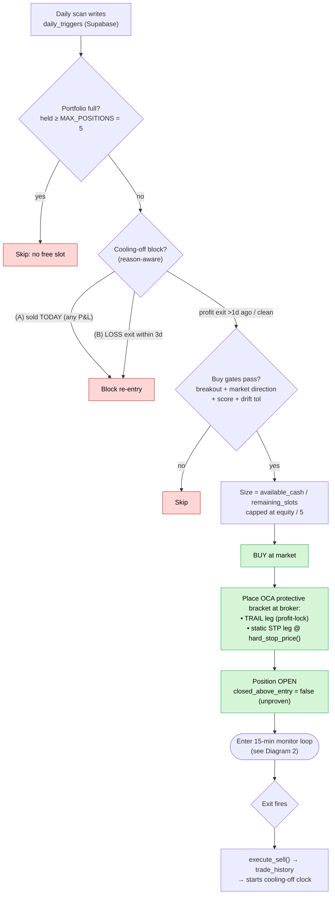
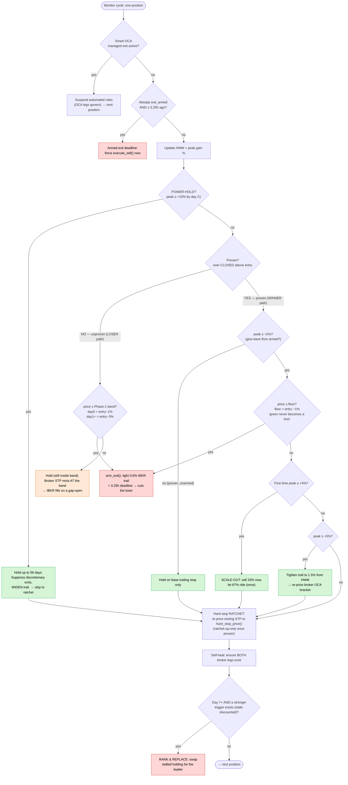
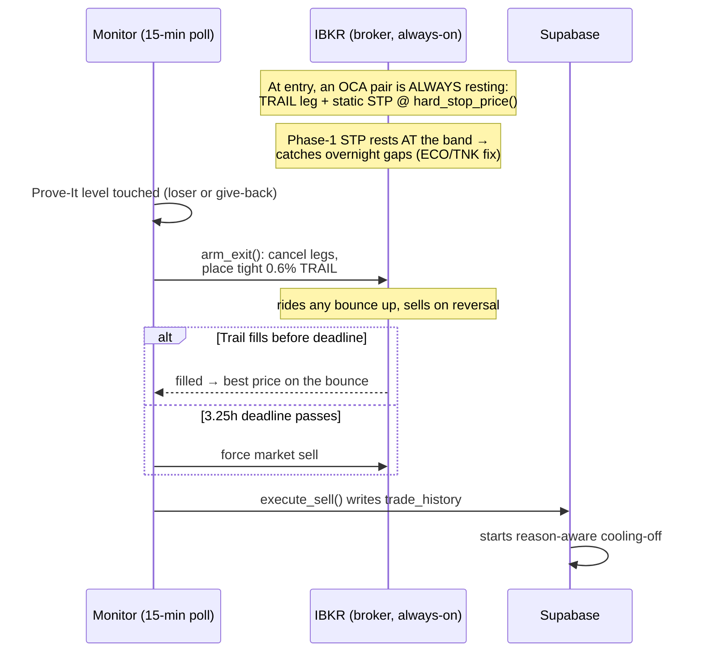

# Trade lifecycle — how winners and losers are treated

> These diagrams are [Mermaid](https://mermaid.js.org/). They render as pictures
> on GitHub, in VS Code (with a Mermaid extension) and in any Mermaid-aware
> Markdown previewer. They will **not** render in a plain terminal or in some IDE
> chat panes — open this file on GitHub to see the flowcharts.

Every value below is read from the live Python, not prose:
`config.py`, `exit_rules.py`, `execution_agent.py`, `cooling_off.py`. When those
change, update this page (see the Doc Sync Rule in `AGENTS.md`).

## Shipped thresholds at a glance

| Rule | Constant | Value |
|---|---|---|
| Concurrent position slots | `MAX_POSITIONS` | 5 |
| Cooling-off window (loss exits) | `COOLING_OFF_DAYS` | 3 days |
| Phase 1 band — day 0 | `PROVE_IT_P1_DAY0_PCT` | entry − 1.0% |
| Phase 1 band — day 1+ | `PROVE_IT_P1_LATER_PCT` | entry − 3.0% |
| Phase 2 arm (give-back floor engages) | `PROVE_IT_P2_ARM_GAIN_PCT` | peak ≥ +2.0% |
| Phase 2 give-back floor | `PROVE_IT_P2_FLOOR_PCT` | entry − 1.0% |
| Partial scale-out trigger / fraction | `SCALE_OUT_TRIGGER_PCT` / `SCALE_OUT_FRACTION` | +4.0% peak / sell 33% |
| Profit-lock trail | `TRAIL_PROFIT_TIERS` | peak ≥ +5% → 1.5% trail from HWM |
| Power-hold gain / trigger / duration | `POWER_HOLD_GAIN_PCT` / `_TRIGGER_DAYS` / `_DURATION_DAYS` | +10% by day 21 → hold 56 days |
| Base trailing stop | `STOP_LOSS_PCT` | 10% |
| Disaster floor (last-resort) | `MAX_LOSS_PCT` | 7% |
| Armed-exit trail / deadline | `ARMED_EXIT_TRAIL_PCT` / `_DEADLINE_HOURS` | 0.6% / 3.25h |

The single question that splits every loss-cutting decision is **"has this
position ever _closed_ above the price we paid?"** — unproven positions get the
tight Phase-1 band; proven positions get the −1% give-back floor and patience.
See `decisions/2026-09-04_prove-it-stop.md`.

---

## 1. Master lifecycle — entry to exit

---

## 2. The exit ladder — evaluated in THIS order, every 15 minutes

Orange = a loser being held inside its band. Red = a sell being triggered.
Green = a winner being protected or left to run.

---

## 3. Why sells rest on the broker, not in Python — the arm/OCA sequence

The bot never relies on its own 15-minute poll to be the only thing standing
between a position and a loss. An OCA (one-cancels-other) pair rests at IBKR from
the moment of entry, so a gap-down or an outage is still caught while the agent is
dark. This is what closed the ECO/TNK overnight-gap hole on 2026-09-22 — see
`decisions/2026-09-26_phase1-broker-primary-stop.md`.

---

## The four scenarios, in one line each

- **Loser (never proves):** capped tight — cut at **−1% day 0**, **−3% day 1+**;
  the resting broker STP at the band catches gaps even while the bot is dark.
- **Winner that fades back:** the **−1% give-back floor** once proven ("a green
  trade never becomes a loss"), plus **33% booked at +4%** that a later fade
  cannot erase.
- **Winner that runs:** **+5% → 1.5% trail** from the peak; **+10% by day 21 →
  power-hold for 8 weeks**, discretionary exits off and the trail widened to let
  it run.
- **Winner that stalls:** **Rank & Replace** swaps the dead-money slot for a
  stronger breakout from day 7 onward.

## Related pages

- `docs/buy_logic.md` — entry gates, trigger ranking, slot allocation, cooling-off
- `docs/sell_logic.md` — the full exit-rule specification with rationale
- `docs/technical_triggers.md` — how a breakout is detected and scored
- `docs/configuration.md` — every constant above as an env var
